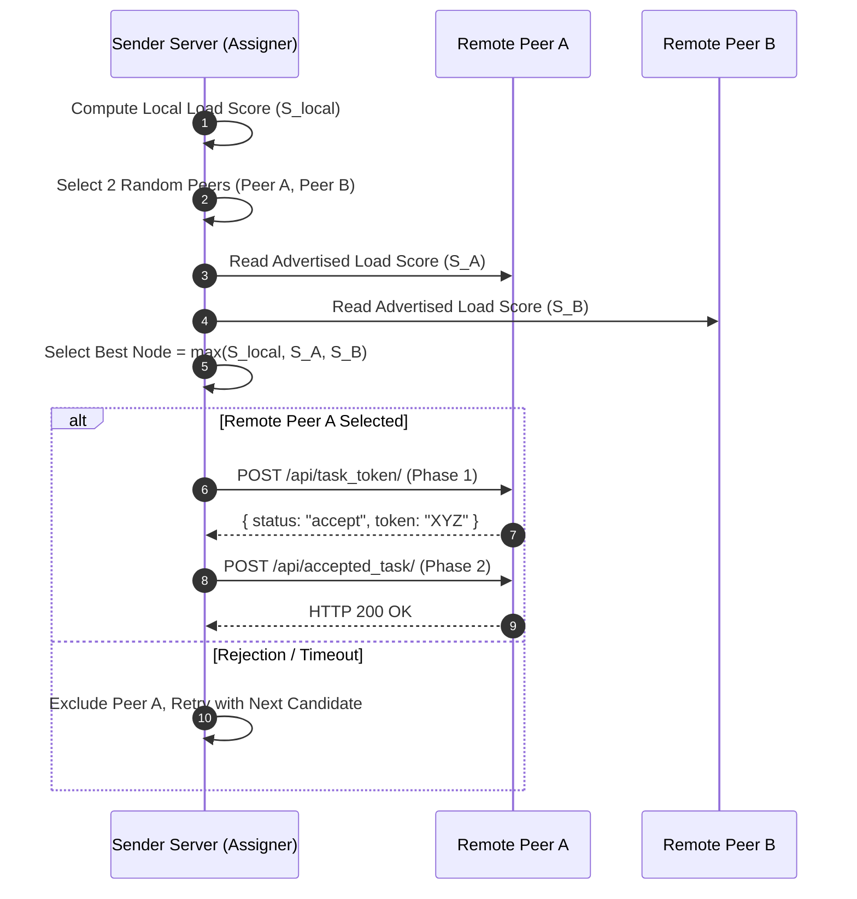
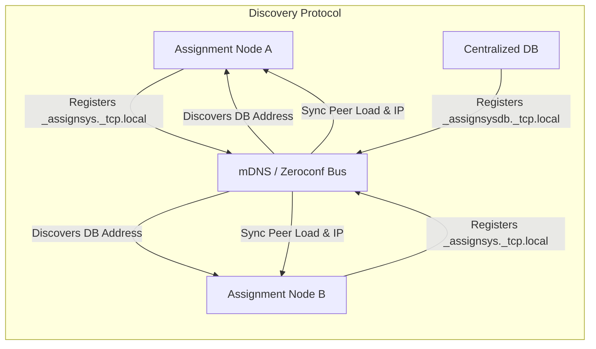
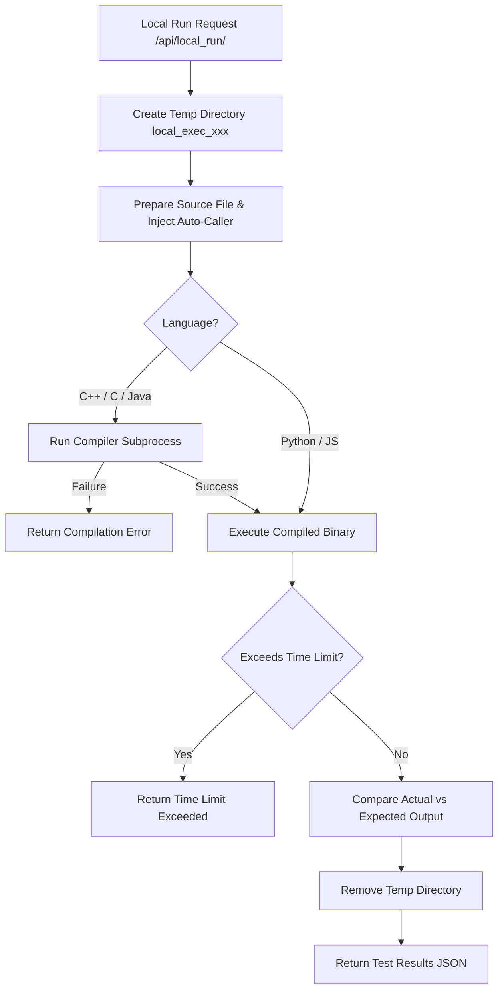
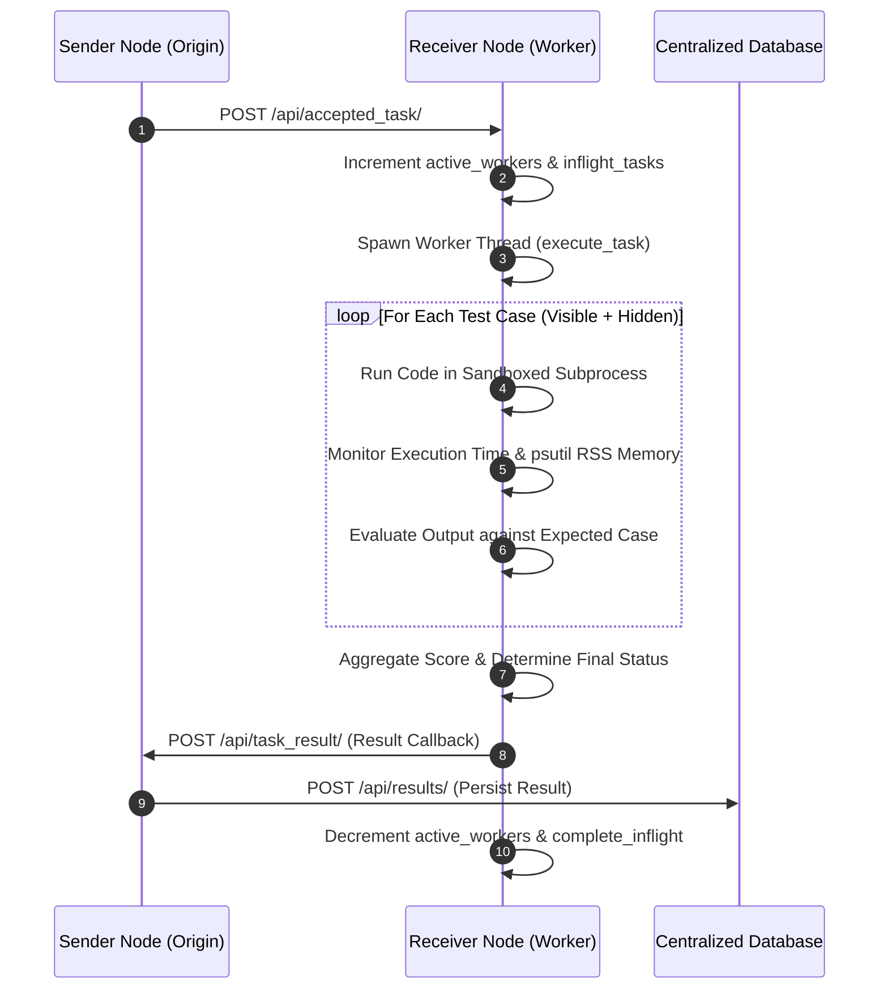
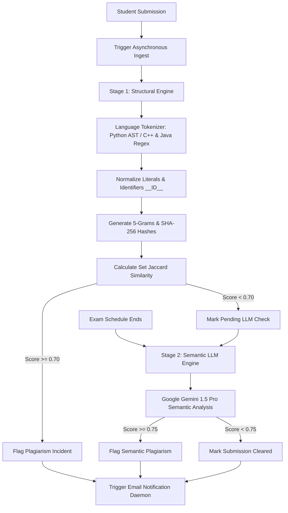
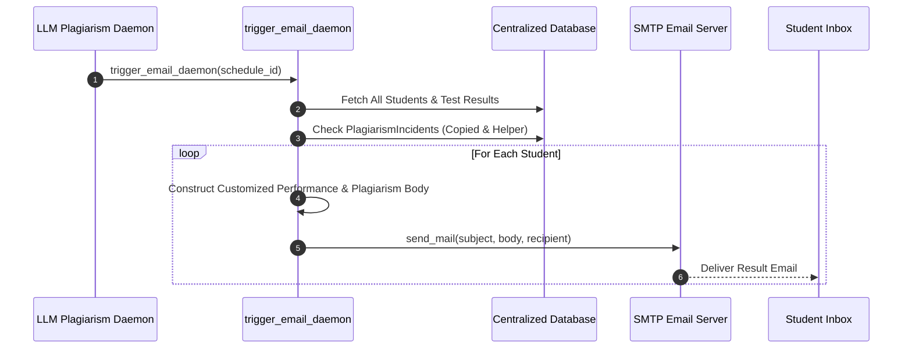
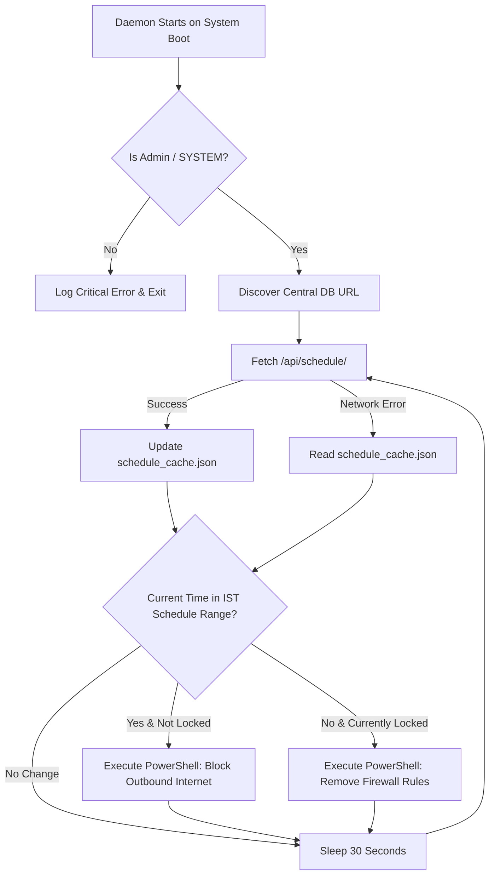

# Assignment System — Comprehensive Feature & Architecture Documentation

## Executive Summary

The **Assignment System** is a distributed, resilient, and secure peer-to-peer platform designed for executing programming assignments, managing automated test evaluation, enforcing exam environment integrity, and detecting academic dishonesty across local area networks (LAN/WiFi).

This document provides a detailed feature-by-feature breakdown of the system architecture, mathematical models, data flows, implementation logic, and exact codebase mappings.

---

## Table of Contents

1. [System Overview & Architecture](#1-system-overview--architecture)
2. [Feature 1: Dynamic Load Balancing & Power of Two Choices (P2C)](#2-feature-1-dynamic-load-balancing--power-of-two-choices-p2c)
3. [Feature 2: Automatic Node Detection & Connection Management over WiFi](#3-feature-2-automatic-node-detection--connection-management-over-wifi)
4. [Feature 3: Local Code Execution in Sandbox](#4-feature-3-local-code-execution-in-sandbox)
5. [Feature 4: Remote Submission Code Execution & Callback Engine](#5-feature-4-remote-submission-code-execution--callback-engine)
6. [Feature 5: Multi-Stage Plagiarism Detection Methods](#6-feature-5-multi-stage-plagiarism-detection-methods)
7. [Feature 6: Email Sending Service & Results Notification Daemon](#7-feature-6-email-sending-service--results-notification-daemon)
8. [Feature 7: Automated Time Schedule Network Lockdown Daemon](#8-feature-7-automated-time-schedule-network-lockdown-daemon)
9. [Feature 8: CLI Commands & System Orchestration Suite](#9-feature-8-cli-commands--system-orchestration-suite)

---

## 1. System Overview & Architecture

The system consists of three main operational tiers:
- **Centralized Database Server (`Centralized_Database`)**: Central repository for user accounts, questions, schedule configurations, final evaluation results, and LLM plagiarism scanning.
- **Assignment Nodes (`Backend/System_Management`)**: Dual-purpose nodes containing both a **Sender Server** (load balancing, task dispatching, UI API) and a **Receiver Server** (worker pool, execution engine, local discovery listener).
- **Client Frontend (`Frontend/system_interface`)**: Interactive React application providing student and administrator portals.

```mermaid
graph TD
    subgraph LAN / WiFi Network
        DB[Centralized Database Server<br/>Port 8000 / mDNS: _assignsysdb]
        
        subgraph Node 1
            F1[React UI] --> B1[Backend Node / Sender]
            B1 <--> R1[Receiver Worker Engine]
        end
        
        subgraph Node 2
            F2[React UI] --> B2[Backend Node / Sender]
            B2 <--> R2[Receiver Worker Engine]
        end
        
        subgraph Node 3 (Headless Worker)
            R3[Receiver Worker Engine]
        end
    end
    
    B1 -- mDNS Zeroconf --> DB
    B2 -- mDNS Zeroconf --> DB
    B1 -- P2C Task Handoff --> R2
    B2 -- P2C Task Handoff --> R3
    R2 -- Result Callback --> B1
    R3 -- Result Callback --> B2
```

---

## 2. Feature 1: Dynamic Load Balancing & Power of Two Choices (P2C)

### Concept
Rather than relying on a single centralized master node or standard round-robin scheduling, the system uses a **Power of Two Choices (P2C)** load balancing algorithm with local-vs-remote capacity scoring. When a node receives a submission, it evaluates its own system metrics against two randomly chosen peer nodes and routes the execution task to whichever node currently possesses the highest available capacity score.

### Mathematical Load Score Model
Every node calculates a capacity score $S \in (0, 100]$ using a geometric weighted model based on five system resource metrics:

$$S = \left(\text{CPU}^{0.35}\right) \times \left(\text{Mem}^{0.20}\right) \times \left(\text{Workers}^{0.20}\right) \times \left(\text{Queue}^{0.10}\right) \times \left(\text{IO}^{0.05}\right) \times 100$$

Where:
- $\text{CPU} = \max(0.01, 1.0 - \text{CPU Usage Ratio})$
- $\text{Mem} = \max(0.01, 1.0 - \text{Memory Usage Ratio})$
- $\text{Workers} = \max\left(0.01, \frac{\text{Workers Limit} - \text{Active Workers}}{\max(\text{Workers Limit}, 1)}\right)$
- $\text{Queue} = \max\left(0.01, \frac{1}{1 + \text{In-flight Tasks}}\right)$
- $\text{IO} = \max(0.01, 1.0 - \text{IO Wait Ratio})$

A higher score indicates greater available capacity.

### Process & Architecture
1. **Candidate Selection**: `assigner.py` queries `node_manager.get_two_nodes()`.
2. **Score Comparison**: Scores of the two remote candidates and the local node (`get_runtime_score()`) are compared.
3. **2-Phase Admission Protocol**:
   - **Phase 1 (Token Request)**: `POST /api/task_token/` is sent to the winning candidate. If accepted, an admission token is returned.
   - **Phase 2 (Task Delivery)**: `POST /api/accepted_task/` delivers the full task payload containing source code, test cases, time/memory limits, and callback parameters along with the token.
4. **Fault Tolerance & Fallback**: If a node rejects the token or fails during delivery, the target is added to a exclusion set and retried up to `MAX_RETRIES`. If all retries are exhausted, the task is re-queued locally.



### Key Files & Implementation
- [Services/load_score.py](../Backend/System_Management/Services/load_score.py): Contains `compute_good_score()` and metric ratio logic.
- [Services/Sender_Server/assigner.py](../Backend/System_Management/Services/Sender_Server/assigner.py): Implements P2C selection, 2-phase token handshakes (`send_token_request`, `send_full_task`), and task re-queuing.
- [Services/Sender_Server/node_manager.py](../Backend/System_Management/Services/Sender_Server/node_manager.py): Tracks node lists and load scores.

---

## 3. Feature 2: Automatic Node Detection & Connection Management over WiFi

### Concept
The platform requires zero manual IP configuration. Nodes automatically discover one another and locate the Centralized Database server across local WiFi/Ethernet subnets using Multicast DNS (mDNS) / Zeroconf service discovery protocols.

### Process & Architecture
1. **Service Registration**:
   - Each node registers an mDNS service `_assignsys._tcp.local.` with service properties including `node_id`, `hostname`, `ip`, `port`, and its real-time `load` score.
   - The Centralized Database server registers under `_assignsysdb._tcp.local.` with property `role: "database"`.
2. **Service Browsing & Dynamic IP Resolution**:
   - `NodeListener` listens for service additions/updates/removals.
   - When the Central DB is discovered, nodes dynamically determine their own active LAN interface IP address by attempting a lightweight UDP socket connection (`socket.SOCK_DGRAM`) to the DB server.
3. **Heartbeat & Re-announcements**:
   - A background thread (`_re_announce_loop`) runs every 30 seconds (`RE_ANNOUNCE_INTERVAL`), recalculating the runtime load score and calling `zc.update_service()`.
4. **Stale Node Eviction**:
   - `_cleanup_stale()` runs periodically. If a peer node has not updated its service within 40 seconds (`NODE_TTL`), it is automatically evicted from the node pool via `on_node_removed()`.



### Key Files & Implementation
- [Services/Sender_Server/network.py](../Backend/System_Management/Services/Sender_Server/network.py): Node registration, Zeroconf listeners, IP auto-detection (`_get_local_ip`), and re-announce loop.
- [Services/Receiver_Server/network.py](../Backend/System_Management/Services/Receiver_Server/network.py): Receiver-side database listener and runtime state update.
- [Centralized_Database/network.py](../Centralized_Database/network.py): Central Database Zeroconf broadcaster (`DatabaseBroadcaster`).

---

## 4. Feature 3: Local Code Execution in Sandbox

### Concept
To allow students to test and debug their solution locally before submitting, the system provides a lightweight local sandbox execution pipeline. This pipeline compiles and executes candidate code against visible sample test cases without consuming distributed network bandwidth.

### Supported Languages & Runtimes
- **Python**: `python` with optional automatic function caller wrapper.
- **C++**: `g++ -O2 -std=c++17`
- **C**: `gcc -O2`
- **Java**: `javac` compiler and `java` runtime (auto-transforms `Solution` class name to `Main`).
- **JavaScript**: `node` runtime.

### Process & Architecture
1. **Isolated Temp Directory**: `tempfile.mkdtemp(prefix='local_exec_')` generates a clean temporary workspace for every execution request.
2. **Source Code Preparation & LeetCode-style Auto-Caller Injection**:
   - If Python code defines `def solution()`, an automatic caller block `if __name__ == '__main__': res = solution(); if res is not None: print(res)` is appended.
   - Similar wrapper logic is appended for JavaScript functions.
3. **Compilation Phase**: Compiled languages execute compiler binaries with strict timeouts (`COMPILE_TIMEOUT = 10s`). Compiler errors (`stderr`) are captured and returned immediately.
4. **Execution & Stream Management**:
   - `subprocess.Popen` executes the compiled binary or interpreter inside the temporary directory.
   - Input data is piped via `stdin`. Output (`stdout`) and error streams (`stderr`) are captured.
5. **Output Normalization & Verification**: CRLF (`\r\n`) line endings are normalized to `\n`, and whitespace is trimmed.
6. **Cleanup**: `shutil.rmtree(tmpdir)` ensures no residual temporary files remain on disk.



### Key Files & Implementation
- [api_management/services/handle_local_run.py](../Backend/System_Management/api_management/services/handle_local_run.py): Defines language configs, source preparation (`_prepare_source`), execution loop (`run_local_code`), and result aggregation (`execute_code_locally`).
- [api_management/views.py](../Backend/System_Management/api_management/views.py): Handles `LocalRunView`.

---

## 5. Feature 4: Remote Submission Code Execution & Callback Engine

### Concept
Actual assignment submissions are distributed across the execution network. Once a worker node accepts a task, it executes the code against both visible and hidden test cases, measures execution metrics (time, memory), evaluates scores, and dispatches an asynchronous callback back to the originating sender node.

### Process & Architecture
1. **Worker Thread Allocation**:
   - Receiving node increments `active_workers` and `inflight_tasks` via `runtime.worker_start()`.
   - Task is handed off to a daemon worker thread (`execute_task`).
2. **Multi-Case Evaluation**:
   - Combines public `test_cases` and private `hidden_test_cases`.
   - Iterates through each test case, enforcing time limits (`time_limit_ms`) and memory boundaries (`memory_limit_mb`).
3. **Execution Metrics Measurement**:
   - **Time**: Measured using high-precision performance counters (`time.perf_counter()`).
   - **Memory**: Monitored per process ID using `psutil.Process(pid).memory_info().rss`.
4. **Status Prioritization**: If multiple test cases produce different failure types, the final status is prioritized:
   $$\text{Compilation Error} > \text{Runtime Error} > \text{TLE} > \text{MLE} > \text{Wrong Answer} > \text{Accepted}$$
5. **Asynchronous Callback Dispatch**:
   - Worker constructs result JSON containing `task_id`, `roll_number`, `question_id`, `status`, `score`, `passed_testcases`, and total `execution_time`.
   - Sends HTTP POST request via `send_result_callback()` to `http://<callback_ip>:<callback_port>/api/task_result/`.
   - Origin node receives callback, updates local task status store, and persists final scores to the Centralized Database.



### Key Files & Implementation
- [Services/Receiver_Server/worker.py](../Backend/System_Management/Services/Receiver_Server/worker.py): Contains core execution functions (`run_code`), multi-testcase evaluator (`evaluate_task`), priority status map, and callback dispatcher (`send_result_callback`).
- [Services/Receiver_Server/main.py](../Backend/System_Management/Services/Receiver_Server/main.py): Flask/HTTP endpoints handling `/api/task_token/` and `/api/accepted_task/`.

---

## 6. Feature 5: Multi-Stage Plagiarism Detection Methods

### Concept
Academic integrity is enforced through a **two-stage hybrid plagiarism detection pipeline**:
1. **Stage 1 (Real-time Structural Fingerprinting & Jaccard Similarity)**: Fast, deterministic n-gram fingerprinting performed immediately upon submission ingest.
2. **Stage 2 (Post-Exam Semantic Analysis via Google Gemini LLM)**: Deep AI analysis performed after exam completion on submissions that evaded structural detection.

---

### Stage 1: Structural AST / Regex Tokenization & Jaccard Engine

#### Tokenization Strategy
- **Python**: Uses Python's built-in `tokenize` module to parse AST tokens. Literals are normalized (`__STR__`, `__NUM__`), keywords are preserved, and variable names are mapped to `__ID__`.
- **C++ / Java**: Uses regex lexing to strip single/block comments, normalize literals, replace non-keyword identifiers with `__ID__`, and preserve language keywords and operators.

#### N-Gram Fingerprint & Hash Construction
The normalized token sequence $T = [t_1, t_2, \dots, t_m]$ is converted into $n$-grams of size $N=5$:

$$g_i = (t_i, t_{i+1}, t_{i+2}, t_{i+3}, t_{i+4})$$

Each $n$-gram is hashed using SHA-256 and truncated to 16 hex characters (8 bytes):

$$h_i = \text{SHA256}("|".join(g_i))[:16]$$

#### Jaccard Similarity Calculation
Given fingerprint hash sets $A$ and $B$ for two student submissions:

$$J(A, B) = \frac{|A \cap B|}{|A \cup B|}$$

If $J(A, B) \ge 0.70$, a plagiarism incident is recorded.

---

### Stage 2: Deep Semantic LLM Analysis (Google Gemini AI)

Submissions that use refactored logic, variable renaming, or altered control structures might evade structural $n$-gram checks.

#### Process
1. Upon exam schedule completion, `run_llm_plagiarism_check()` queries unflagged submissions grouped by question.
2. Formats submissions into a structured JSON payload and passes them to `gemini-1.5-pro`.
3. The prompt instructs the LLM to analyze semantic intent, logic sequence, hidden bug similarity, and non-standard idioms.
4. Any pair yielding a semantic similarity score $\ge 0.75$ is recorded in the `PlagiarismDetected` database table.



### Key Files & Implementation
- [api_management/services/plagiarism_pipeline.py](../Backend/System_Management/api_management/services/plagiarism_pipeline.py): Background daemon trigger (`trigger_plagiarism_pipeline`).
- [Centralized_Database/results/plagiarism_engine.py](../Centralized_Database/results/plagiarism_engine.py): Implementation of Python AST / regex tokenization, 5-gram hashing, and `jaccard_similarity()`.
- [Centralized_Database/results/llm_plagiarism.py](../Centralized_Database/results/llm_plagiarism.py): Background job executing Google Gemini AI semantic checks (`run_llm_plagiarism_check`).

---

## 7. Feature 6: Email Sending Service & Results Notification Daemon

### Concept
Once an exam schedule ends and plagiarism evaluations are complete, the system automatically compiles individual student score reports and plagiarism status summaries, dispatching them directly to students via SMTP email.

### Process & Architecture
1. **Trigger Condition**: `trigger_email_daemon(schedule_id)` is invoked automatically upon completion of the LLM plagiarism verification job or schedule expiration.
2. **Student Record Retrieval**: Queries all active student accounts containing non-empty email addresses (`User.objects.filter(role='student')`).
3. **Report Generation**:
   - Aggregates question-by-question scores and execution statuses from `Result` model.
   - Queries `PlagiarismDetected` model for both copied incidents (student flagged as copier) and helper incidents (student code used as copying source).
4. **Email Dispatch**:
   - Formats a clear plain-text report.
   - Dispatches email via Django's core `send_mail()` wrapper using settings configured in `settings.DEFAULT_FROM_EMAIL` and SMTP parameters.



### Key Files & Implementation
- [Centralized_Database/results/services.py](../Centralized_Database/results/services.py): Contains `trigger_email_daemon()` implementation.

---

## 8. Feature 7: Automated Time Schedule Network Lockdown Daemon

### Concept
To prevent students from accessing external resources, messaging platforms, or unauthorized websites during an official examination, the platform includes an autonomous background service (`lockdown_daemon.py`). It enforces **network lockdown** by applying strict Windows NetFirewall rules during active exam schedules—blocking outbound Internet access while explicitly keeping local subnet (LAN/WiFi) traffic open for node communication.

### Process & Architecture
1. **Administrative Windows Task Execution**: Installed as a Windows Scheduled Task (`ExamLockdownDaemon`) running under `SYSTEM` privileges with `HIGHEST` run level on startup (`schtasks /sc onstart`).
2. **Schedule Discovery & Multi-Tier Fallback**:
   - Daemon polls `/api/schedule/` every 30 seconds (`POLL_INTERVAL`).
   - Discovers Central DB URL through `.env` (`DATABASE_SERVER_IP`), Zeroconf mDNS (`_assignsysdb._tcp.local.`), or local node API (`/api/node_info/`).
   - Maintains a local disk cache (`schedule_cache.json`) to retain schedule awareness even during network fluctuations.
3. **Time Window Parsing**:
   - Converts schedule start and end timestamps into Indian Standard Time (IST / UTC+05:30).
   - Evaluates whether current system time falls within `[start_time, end_time]`.
4. **PowerShell Firewall Enforcement**:
   - **Lockdown Activation**: When inside exam window, executes PowerShell command:
     ```powershell
     New-NetFirewallRule -DisplayName 'ExamSystem_BlockInternet' -Direction Outbound -Action Block -RemoteAddress Internet -Enabled True
     ```
   - **Lockdown Deactivation**: When outside exam window, executes:
     ```powershell
     Remove-NetFirewallRule -DisplayName 'ExamSystem_BlockInternet' -ErrorAction SilentlyContinue
     ```



### Key Files & Implementation
- [lockdown_daemon.py](../lockdown_daemon.py): Core daemon script containing Discovery, IST time parsing (`is_ist_now_in_range`), cache management (`save_cache`, `load_cache`), and PowerShell execution (`lock_internet`, `unlock_internet`).
- [install_daemon.bat](../install_daemon.bat): Windows batch script registering scheduled task via `schtasks`.
- [stop_daemon.bat](../stop_daemon.bat): Batch script for terminating and deleting lockdown task.

---

## 9. Feature 8: CLI Commands & System Orchestration Suite

### Concept
The platform provides a suite of command-line entry points and background launchers allowing administrators and students to initiate specific node roles (Full Assignment Node, Headless Worker Node, or Centralized Database Server) with custom port bindings and automatic environment injection.

### CLI Commands (`cli.py`)

#### Command Line Arguments
```bash
python cli.py [--assignment] [--db_server] [--worker_only] [--port PORT]
```

#### Operational Modes
1. **Full Assignment Node (`--assignment`)**:
   - Updates React environment configuration (`REACT_APP_NODE_PORT`).
   - Launches Backend Node Django instance (`manage.py runserver 0.0.0.0:<port>`).
   - Spawns React Frontend via `npm start`.
2. **Centralized Database Server (`--db_server`)**:
   - Launches Central DB Django server on specified port.
   - Spawns autonomous central background daemon (`central_db_daemon.py`).
3. **Headless Worker Node (`--worker_only`)**:
   - Launches headless Backend execution node without React UI, ideal for dedicated computing nodes across the LAN.

#### Graceful Shutdown Management
`cli.py` tracks all spawned subprocess PIDs. Upon receiving a `SIGINT` (Ctrl+C), it iterates through active processes, terminating (`p.terminate()`) and waiting for them to close cleanly.

### Batch & Background Launchers
- **`launcher.py`**: Background launcher executing Central DB, background daemon, and React UI in no-window mode (`CREATE_NO_WINDOW` on Windows).
- **`setup.bat`**: Automated setup script for initializing Virtualenv, installing Python dependencies from `requirements.txt`, and configuring initial settings.
- **`updater.bat`**: Automatic git repository sync script.

```mermaid
flowchart TD
    CLI[python cli.py] --> ParseArgs{Parse Flags}
    
    ParseArgs -- --assignment --> Mode1[Assignment Node + React]
    Mode1 --> UpdateEnv[Update React .env REACT_APP_NODE_PORT]
    UpdateEnv --> SpawnDjango[Spawn Django Backend Port X]
    UpdateEnv --> SpawnReact[Spawn React npm start]
    
    ParseArgs -- --db_server --> Mode2[Central Database Server]
    Mode2 --> SpawnDB[Spawn Central DB Django Port X]
    Mode2 --> SpawnDaemon[Spawn central_db_daemon.py]
    
    ParseArgs -- --worker_only --> Mode3[Headless Compute Worker Node]
    Mode3 --> SpawnWorker[Spawn Django Worker Node Port X]
    
    Mode1 --> ListenSig[Listen for Ctrl+C]
    Mode2 --> ListenSig
    Mode3 --> ListenSig
    ListenSig --> CleanShutdown[Terminate All Subprocesses Gracefully]
```

### Key Files & Implementation
- [cli.py](../cli.py): Main CLI orchestrator.
- [launcher.py](../launcher.py): Silent launcher script.
- [install_daemon.bat](../install_daemon.bat) & [stop_daemon.bat](../stop_daemon.bat): Administrative lockdown management scripts.
- [setup.bat](../setup.bat): Environment installer.

---
*Documentation compiled automatically for the Assignment System codebase.*
